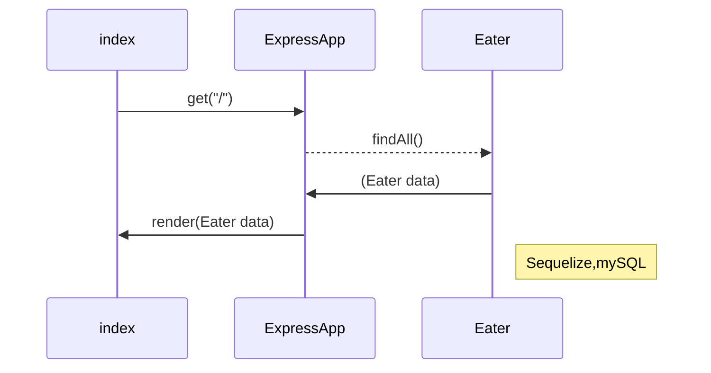

# TakeMeToDinner!

TakeMeToDinner! has been created to bring people together in dinner dates!  Simply create a person profile in the website, listing your preferred restaurants and wait for messages from other users inviting you to go out on a dinner date.

## Demo
Watch a [video demo](https://youtu.be/dKTcadWloh4) of the web application.


## Directory Structure

    <takemetodinner>
    |
    |   README.md (This file)
    |   server.js (Express JS Server - Main program)
    |   
    +---config
    |       config.js (Contains configuration variables for connecting to backend DB)
    |       
    +---doc (Documentation for the app- Requirements, Design, etc).
    |       Capture.JPG 
    |       mvp.txt
    |       usage_scenarios.docx
    |       usage_scenarios.pdf
    |       Visio-wireframe.pdf
    |       wireframe.vsd
    |       
    +---models
    |       Eater.js (Model for the Eater entity. Think of an active user profile). 
    |       index.js (Boilerplate javascript generated by sequelize init)
    |       Message.js (Model for the Message entity. A response sent to an Eater). 
    |       schema.sql (Initial Database Creation script).
    |       
    +---public
    |   |   orig_add.html (Not used anymore).
    |   |   orig_index.html (Not used anymore).
    |   |   
    |   +---js
    |   |       add.js (Front-end code for the add.hbs page)
    |   |       index.js (Front-end code for the index.hbs page)
    |   |       locsearch.js ((Front-end code for the profile-block.hbs page)
    |   |       
    |   \---styles
    |           add_styles.css (Styles for the add.hbs page)
    |           styles.css (Styles for the main page)
    |           
    +---routes
    |       apiRoutes.js (Javascript code for API routes).
    |       htmlRoutes.js (Javascript code for HTML routes).
    |       
    \---views
        |   404.handlebars (NOT FOUND page used by HBS)
        |   add.handlebars ( add user profile page).
        |   example.handlebars (not used)
        |   index.handlebars ( main page)
        |   
        +---layouts
        |       main.handlebars (main handlebars layout)
        |       
        \---partials (handlebars partials).
            \---profile
                    profile-block.handlebars (Renders a record for Eater).


## MVC Architectural Pattern
The application follows the Model-View-Controller architectural pattern.  Handlebars JS implements the "**V**iew*", while Express JS implements the **C**ontroller code in Javascript.  Sequelize and mySQL database complete the **M**odel. 
The following interaction diagram shows how the layers talk to each other during execution of the "/" html route (The root document): 



# How to install your own copy of the application.  

This method uses de ```dotenv``` npm package (already saved as a dependency in the package.json file) to save the database connection parameters in a ```.env``` file and read them into 
the ```process.env``` object, making them available to the application without changing the application code (specifically, the config.js file).

1) Clone the master branch into your projects directory:
```git clone <project repo URL>```

2) Create a ".env" file in the project top directory with the following contents:
```
MYSQL_HOST=localhost
MYSQL_USER=root
MYSQL_PASSWORD=<The password for the root user in MySQL>
MYSQL_DBNAME=<Your database name>
```

3) Install dependencies via : 
```npm install```

4) Run the project:
``` node server.js ```

You can connect then to the application via the browser, at http://localhost:3000/.
